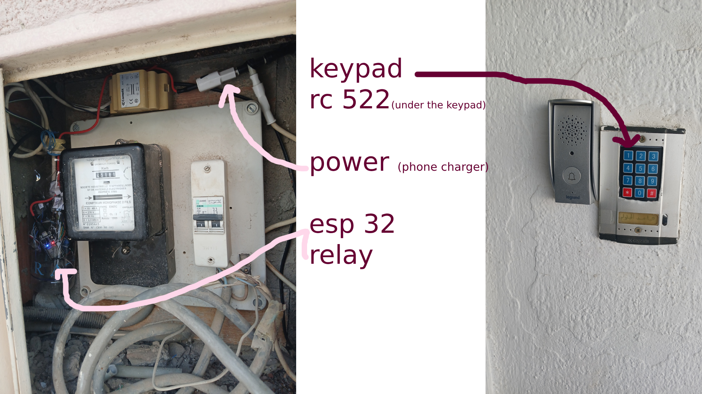

<h3 align="center">ESP32 Door Unlock System</h3>



<!-- TABLE OF CONTENTS -->
<details>
  <summary>Table of Contents</summary>
  <ol>
    <li><a href="#about-the-project">About The Project</a></li>
    <li><a href="#wiring">Wiring</a></li>
    <li><a href="#software-setup">Software Setup</a></li>
    <li><a href="#programming-the-esp32">Programming the ESP32</a></li>
    <li><a href="#information--troubleshooting">Information & Troubleshooting</a></li>
  </ol>
</details>

## About The Project

Unlock your door using multiple methods with an ESP32!  
This project combines:

- **RFID authentication**
- **Keypad password entry**
- **Wi-Fi-based unlocking through a browser**

Originally, the system was built using just an RFID reader. Later, a keypad and Wi-Fi interface were added for more flexibility and convenience.

### Modes of Operation

- **RFID-only** (initial version: `system-code`)
- **Keypad entry**
- **Web interface access**

Use the `reader-code` to find your card UIDs and replace the placeholders in `system-code`.

---

## Wiring

### 1. RFID RC522 to ESP32

Connect the RFID reader like this:

| RC522 Pin | ESP32 GPIO               |
| --------- | ------------------------ |
| SDA (SS)  | 22                       |
| SCK       | 19                       |
| MOSI      | 23                       |
| MISO      | 25                       |
| RST       | 27                       |
| GND       | GND                      |
| 3.3V      | 3.3V                     |
| IRQ       | Not connected (optional) |

Use `reader-code` to read the UID of each RFID card.

---

### 2. Relay Module to ESP32

| Relay Pin | ESP32 GPIO |
| --------- | ---------- |
| IN1       | 5          |
| GND       | GND        |
| VCC       | 3.3V       |

Connect the relay output to your door lock.

---

### 3. Keypad to ESP32

This project uses a 4x3 keypad (12 keys, 7 wires).  
After testing, the following wiring worked:

| Wire # | ESP32 GPIO |
| ------ | ---------- |
| 1      | 14         |
| 2      | 12         |
| 3      | 13         |
| 4      | 26         |
| 5      | 4          |
| 6      | 32         |
| 7      | 33         |

Use the `keypad-reader` code to verify your wiring with the Serial Monitor.

---

## Software Setup

1. Install **Arduino IDE**.
2. Install **ESP32 board package** via the Board Manager.
3. Install the following libraries:
   - `MFRC522` (for RFID)
   - `Keypad` (for keypad)

---

## Programming the ESP32

Use the code in `rfid-wifi-keypad`.

### Wi-Fi Credentials

Replace with your own network credentials:

```cpp
constexpr char ssid[] = "your-wifi-name";
constexpr char password[] = "your-wifi-password";
```

### Web Access

Once uploaded:

- Get the ESP32’s IP address (check your router or Serial Monitor).
- Access this URL in a browser:

```
http://[ESP32-IP]/open
```

This unlocks the door via the relay.

---

### Keypad Configuration

Set your password:

```cpp
constexpr char correctPassword[] = "0000";
```

Instructions:

- Press the correct password followed by `#` to unlock the door.
- Press `*` to clear and re-enter the password.

---

### RFID Configuration

Replace placeholder UIDs in the code with your actual card UIDs using the format:

```cpp
const byte allowedUIDs[][4] = {
  {0xXX, 0xXX, 0xXX, 0xXX}
  ...
};
```

If the UID matches, the relay will be activated.

---

## Information & Troubleshooting

- **Wiring Note**: Make the RFID wires as short as possible. Long or poor-quality wires can cause unreliable readings.
- **Stability**: Occasionally, the RFID would stop working after unlocking. To solve this, the following line was added inside the `unlockDoor()` function:

```cpp
ESP.restart(); // Restart ESP32 after every unlock
```

This made the system much more reliable over time.

---

Now, the door can be opened via RFID, keypad, or even a phone browser over local Wi-Fi.

```

```
